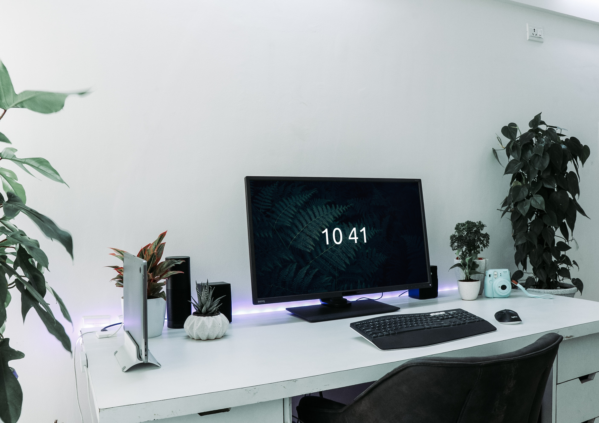

# A Simple Clock Screensaver

This simple screensaver was made using [Pygame](pygame.org). It is simply a fullscreen application that quits when the mouse moves or a keyboard input is detected. Using [PyInstaller](pyinstaller.org), we can convert this Python program into an executable file. Then if we change the extension from ".exe" to ".scr", windows recognises it as a screensaver program. There are two python programs here, *[simple_clock_screensaver.py](simple_clock_screensaver.py)* and *[python_to_screensaver.py](python_to_screensaver.py)*. *simple_clock_screensaver.py* is the screen saver program and *python_to_screensaver.py* is the program that converts the other into a screensaver file. The result is a simple clock on a fern background image.

